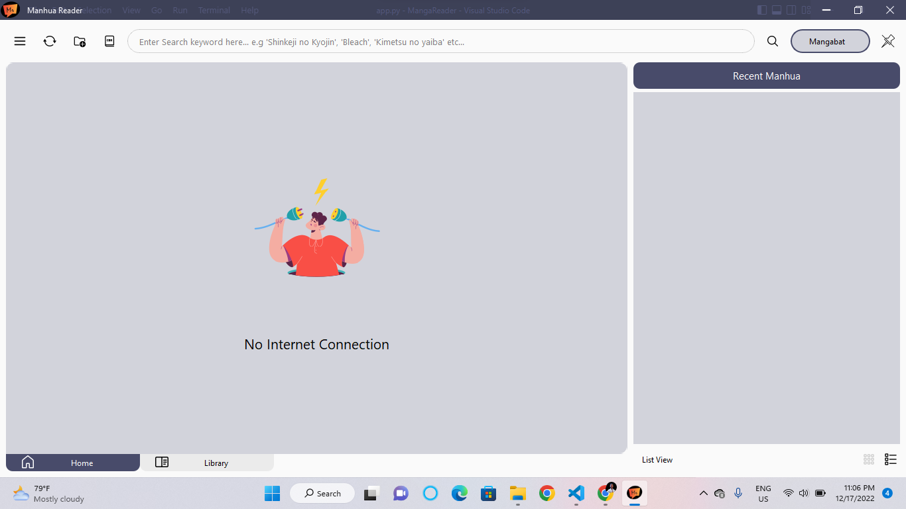

# MangaReader

### First Major Personal Python Project.

Birthed through my curiosity about how GUI applications are made and a longing for a free desktop application to read manhua files offline, I researched, planned, designed and developed a manga/**manhua**/manhwa reading desktop application.

It was implemented purely in `Python` and `PyQt6`.

This manhua reader supports reading manga `offline from directory` and in archived format `*.cbz`, `*.zip`.

# Features

### Implemented the following features:
- Themes(Light & Dark modes) 
- Easy to use User Interface(tooltips are available almost everywhere)
- Option to Toggle between List and Grid views in Library.
- Import Zip files containing images and Cbz files only.
- Load a folder containing images in the correct structure from disk.
- Supports images in `jpg`, `jpeg`, and `png` formats.
- Three different reading modes: `Webtoon (Vertical)`, `Left-to-Right` and `Right-to-Left`
- Set Cover feature: allows you to set any image you find appealing as the manga cover.
- Shortcut keys for navigation: 
    - `Q` for Previous Chapter.
    - `E` for Next Chapter.
    - The following do not take effect in Webtoon(Vertical) reading mode.
        - `A` for Previous page.
        - `D` for Next page.
- History feature allows you to pick up from whence you left off.
- Serialized with `json`, masked under the `.mhr` extension. __Do not alter the `metadata.mhr` configuration file.__
- Nice Splash Screen.

### Correct Directory Structure

    Bundle Folder/  |
                    |
                    |--- Chapter 1/|
                    |              | --- image1.png
                    |              | --- image2.png
                    |              | --- image3.png
                    |
                    |--- Chapter 2/|
                    |              | --- image1.png
                    |              | --- image2.png
                    |              | --- image3.png
                    .
                    .
                    .
                    |--- cover.jpg

Keep your images sorted in chapter folders and then nest them in a Manhua folder. That Manhua Folder is what you should select when importing folder bundle. You should archive your zip or cbz files in the same manner.
- The name of the bundle folder is recognized as the Manhua Name.
- The first image file found in the bundle folder is set as the manhua cover. A default cover is provided if no image file is found in the bundle folder.

## What it looks like
### Light Mode
Home View

Library View

### Dark Mode
Library in Dark Mode

Description Page

Reader View

# Future Plans
Further release updates will include online scraping, viewing and downloading features...(Not coming soon :disappointed_relieved:)... 
But ***Stay tuned***
